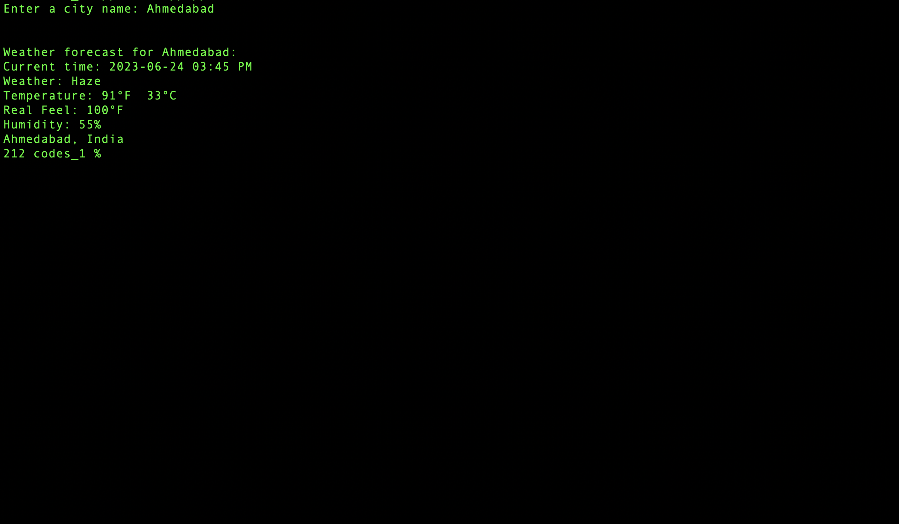

<!-- ABOUT THE PROJECT -->
## About The Project

Weather Forecasting Tool - Create a command line tool that accepts a city's name and returns the current weather forecast. Leverage OpenWeatherMap API to fetch weather data and parse it using Python.


<!-- GETTING STARTED -->
## Getting Started

<b style="font-size:20px;">File 1:-</b> <hr>
        <b style="font-size:17px;">app.py</b>
       <b> <p> This file core command line implementation code.
        We used the Replace with your OpenWeatherMap API key</p></b>

        
        

        


Output:-



### Before runing map.py thes are the necessary modules should be install first

1. Install Streamlit Folium
```sh
    pip install streamlit_folium
```
2. Install Geopy
```sh
    pip install geopy
```
3. Install Folium
```sh
    pip install folium
```  
   
4. Install Streamlit
```sh
    pip install streamlit
```

<b style="font-size:20px;">File 2:-</b>
<hr><b> map.py
             This file contain GUI implementation code.  
    For run map.py file use below:</b>

<p> 
    
   <b> Certainly! Here's an overview of the provided code by github copilot:</b>

    1. The code begins with importing necessary libraries such as `requests`, `json`, `datetime`, `folium`, `streamlit`, and `streamlit_folium`.

    2. The `get_weather_forecast(lat, longi)` function is defined. It takes latitude and longitude coordinates as parameters and retrieves weather data from the OpenWeatherMap API using those coordinates. It returns the city name, current time, weather conditions, temperature, real feel temperature, and humidity.

    3. An instance of `folium.Map()` is created and stored in the variable `m`. This map object will be used to display the interactive map.

    4. The `st_folium()` function from the `streamlit_folium` library is used to create a Streamlit component from the folium map. The `map` object is passed as an argument, along with the desired height and width.

    5. A button is created using `st.button()` with the label "Get Selected Place". This button will be used to trigger the retrieval of weather information for the selected location on the map.

    6. If the button is clicked (`button_clicked` is `True`), the code inside the `if` block is executed.

    7. An empty list `data` is created to store the latitude and longitude of the selected place.

    8. The latitude and longitude coordinates of the last clicked location on the map are retrieved using `map['last_clicked']['lat']` and `map['last_clicked']['lng']`, respectively. These values are appended to the `data` list.

    9. If `data` is not empty (i.e., latitude and longitude values are available), the `get_weather_forecast()` function is called with the latitude and longitude as arguments.

    10. The returned weather information is displayed using `st.write()` statements, including the city name, time, weather conditions, temperature, real feel temperature, and humidity.

    11. There is a `try-except` block to handle any exceptions that may occur during the execution of the code. If an exception occurs, the `pass` statement allows the program to continue without taking any action.

    Comments have been added to the code below for further explanation:


</p>

```sh
        streamlit run map.py
```

Output:-


<!-- CONTACT -->
## Contact

Gmail: vrajpatelxbz@gmail.com
<br>
Project Link: [https://github.com/Vraj-311/Ms_hackathon_2023.git]

